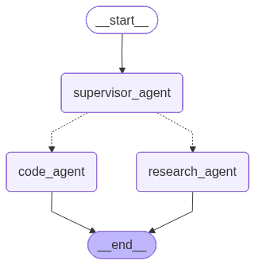

## LangChain vs LangSmith vs LangGraph vs Ollama

**LangChain**, **LangSmith**, and **LangGraph** are complementary tools for building, monitoring, and visualizing LLM-powered applications. Here’s a concise comparison:

---

### LangChain

- **Purpose:** Open-source framework for building applications powered by large language models (LLMs).
- **Focus:** Orchestrating LLM-based pipelines for chatbots, question answering, agents, and more.
- **Key Features:**
    - Prompt templates
    - Chains & workflows
    - Memory management
    - API and data source integration
- **Use Cases:** Building LLM apps, agents, chatbots, summarizers.

---

### LangSmith

- **Purpose:** Developer platform for tracking, evaluating, and debugging LLM applications.
- **Focus:** Observability and quality assurance for LLM-powered apps.
- **Key Features:**
    - Logs all LLM calls and interactions
    - Visualizes chains and agent steps
    - Tracks inputs, outputs, and errors
    - Evaluation metrics for performance
- **Use Cases:** Debugging, monitoring, and improving LangChain or other LLM workflows.

---

### LangGraph

- **Purpose:** Tool for visualizing, building, and exploring chains of LLM interactions as graphs.
- **Focus:** Graph-based visualization and management of complex LLM workflows.
- **Key Features:**
    - Visual graph representation of LLM chains
    - Interactive editing and exploration
    - Understanding dependencies and flow
- **Use Cases:** Designing, visualizing, and managing multi-step LLM pipelines or agent workflows.

#### LangGraph Example

Below is a sample visualization of an LLM workflow using LangGraph:

 
---

### Summary Table

| Tool       | Primary Purpose                        | Key Features                  | Use Case                                 |
|------------|----------------------------------------|-------------------------------|------------------------------------------|
| LangChain  | Build LLM applications and workflows   | Chains, memory, prompts, APIs | Creating chatbots, agents, QA systems    |
| LangSmith  | Monitor, debug, and evaluate LLM apps  | Logging, visualizations, metrics | Testing and improving LangChain apps     |
| LangGraph  | Visualize and manage LLM chains as graphs | Graph UI, interactive editing | Visualizing and designing complex workflows |

---

**In simple terms:**
- Use **LangChain** to build your LLM-powered app.
- Use **LangSmith** to track and debug your app’s behavior.
- Use **LangGraph** to visualize and design the app’s flow as a graph.

---

## What is Ollama?

**Ollama** is a platform and toolkit designed to run and manage large language models (LLMs) locally on your machine, focusing on privacy, control, and ease of use.

**Key Points:**
- **Local LLM hosting:** Run powerful language models on your own computer.
- **Privacy-first:** Models and data stay local, ideal for sensitive information.
- **Easy CLI & SDK:** Simple command-line tools and SDKs for interacting with local LLMs.
- **Model management:** Download, manage, and switch between open-source LLMs easily.

**Use Cases:**
- Running LLM-powered apps without exposing data to external servers.
- Experimenting with open-source models like LLaMA variants locally.
- Developing privacy-sensitive AI applications.
- Rapid prototyping without internet dependency.

**Comparison:**
- **Vs Cloud APIs (OpenAI, Hugging Face):** Ollama runs locally—no API costs or latency, but requires sufficient hardware.
- **Vs LangChain:** LangChain is a framework to build apps with LLMs (can use Ollama as a local LLM provider).

